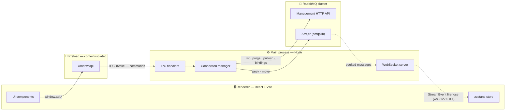

<div align="center">

# 🐰 Rabbit Wrangler

**A desktop control room for your RabbitMQ clusters.**

Peek at live messages without consuming them · rescue dead-lettered messages ·
purge, publish, and inspect — across many brokers at once.


</div>

---

## Why

The RabbitMQ Management UI is great for cluster operations, but day-to-day
_message_ work — "what's actually flowing through this queue right now?",
"why did these end up in the dead-letter queue, and can I put them back?" — is
clumsy in a browser tab. Rabbit Wrangler is a focused desktop app for exactly
that: a fast, VSCode-style cockpit for the **message plane**, with the safety
rails that destructive RabbitMQ operations deserve.

## Features

- 🔍 **Non-destructive peek** — watch messages flow through a queue live. A
  `NACK`-and-requeue consumer means **nothing is ever consumed**; each message
  is de-duplicated and surfaced once, with full properties, headers, and an
  `x-death` breakdown for dead-lettered messages.
- 📦 **Read-only payload viewer** — selected messages open in an embedded
  **Monaco** editor (the editor that powers VS Code) with JSON syntax
  highlighting, in a resizable, size-remembering pane.
- ♻️ **Move from the dead-letter queue** — drain a DLQ and republish to a target
  exchange/routing key on a **publisher-confirm** channel. A crash mid-move can
  duplicate but **never drop**; unroutable targets abort instead of vanishing.
- 🧹 **Purge** — empty a queue, with confirmation.
- 📤 **Publish** — a RabbitMQ-web-UI-style composer: headers (typed), message
  properties, delivery mode, and payload encoding; reports routed vs. unrouted.
- 🔗 **Exchanges & bindings** — browse exchanges, view their bindings, and see an
  **SVG binding diagram** (exchange → destinations) at a glance.
- 🗂️ **Many clusters at once** — connect to multiple brokers and switch between
  them from a single tree.
- 🔐 **Encrypted credentials** — passwords are sealed with the OS keychain
  (`safeStorage`); plaintext never leaves the main process or reaches the UI.
- 🖥️ **Native, VSCode-style UI** — custom title bar, activity bar, resizable
  sidebar, context menus, and a dark theme throughout.

## Getting started

### Prerequisites

- **Node.js 20+**
- **[pnpm](https://pnpm.io/)** — this project uses pnpm, not npm/yarn (build
  scripts for `electron`/`esbuild` are allow-listed in `pnpm-workspace.yaml`).
- A **RabbitMQ** broker with the **management plugin** enabled (HTTP API on port
  `15672`) — that's the default in most RabbitMQ distributions.

### Install & run

```sh
pnpm install      # also downloads the Electron binary via allow-listed build scripts
pnpm dev          # launch the app with hot-module reload
```

Then add a connection from the **Connections** menu (host, management port,
AMQP port, credentials) and start exploring your queues.

### Build & package

```sh
pnpm build        # typecheck + bundle all targets to out/
pnpm build:win    # package an installer (also :mac / :linux)
```

### Other scripts

```sh
pnpm typecheck    # type-checks main/preload (no DOM) and renderer (DOM) separately
pnpm lint         # ESLint (flat config)
pnpm format       # Prettier
```

## Architecture

Rabbit Wrangler is an [electron-vite](https://electron-vite.org/) app with three
targets plus a shared contract, and a **deliberately split transport** design.



**Two transports between UI and main:**

1. **IPC `invoke` = commands (request/response).** The renderer never touches
   `ipcRenderer`; it calls `window.api.*`, which maps 1:1 to handlers in the
   main process.
2. **WebSocket = the event firehose (server push).** Peeked messages arrive at
   high frequency, so they bypass IPC over a localhost-only WebSocket. The
   renderer folds each `StreamEvent` into the store.

**Two RabbitMQ planes per cluster:**

- **Management HTTP API** for the management plane — list queues/exchanges, read
  stats, purge, publish, read bindings. Always available.
- **AMQP (`amqplib`)** for the message plane — peek and move. Opened lazily, only
  when a message operation is first requested.

### Project layout

```
src/
├─ main/        Electron main process (Node) — owns all RabbitMQ connections
├─ preload/     context-isolated bridge exposing window.api
├─ renderer/    React UI (Vite) — no Node/broker access; talks via window.api / WS
└─ shared/      types + IPC contract, imported by all three
```

See [CLAUDE.md](CLAUDE.md) for a deeper tour of the design and its trade-offs, and
[docs/API.md](docs/API.md) for the full API reference (the `window.api` contract,
RabbitMQ Management API coverage, and a roadmap).

## Tech stack

electron-vite · Electron · React 19 · Vite 7 · TypeScript 6 · zustand ·
[`amqplib`](https://www.npmjs.com/package/amqplib) · `ws` · Monaco Editor ·
[`@vscode/codicons`](https://github.com/microsoft/vscode-codicons) ·
electron-store · electron-builder.

## Security notes

- `contextIsolation` is **on**; the renderer has no direct Node or broker access.
- A Content-Security-Policy restricts the renderer's outbound connections to
  `self` and the localhost event WebSocket (`ws://127.0.0.1:*`).
- Credentials are encrypted at rest with the OS vault and only ever decrypted in
  the main process.

## License

[MIT](LICENSE) © frontforge — free to use, modify, and distribute; just keep the
copyright and license notice.

---

<div align="center">
<sub>Built with 🐰 and Electron.</sub>
</div>
